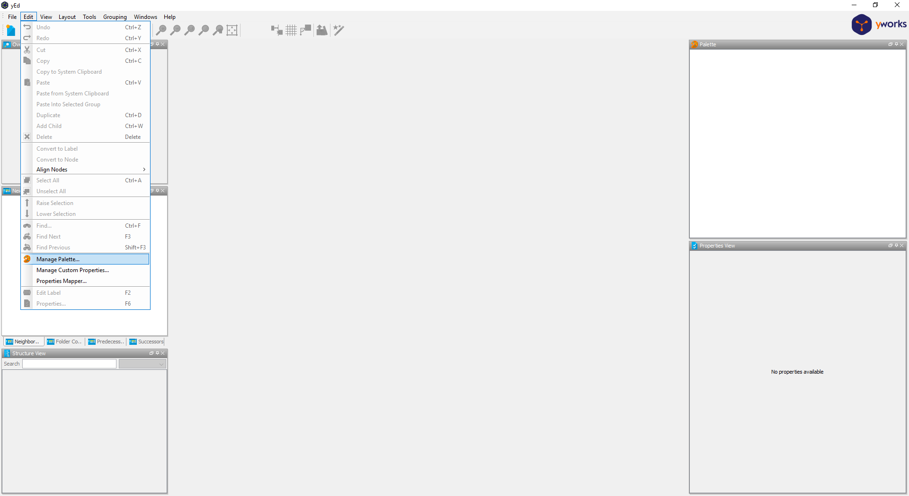
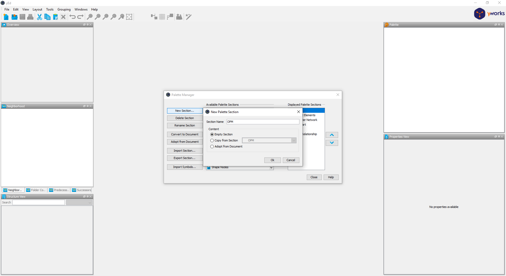
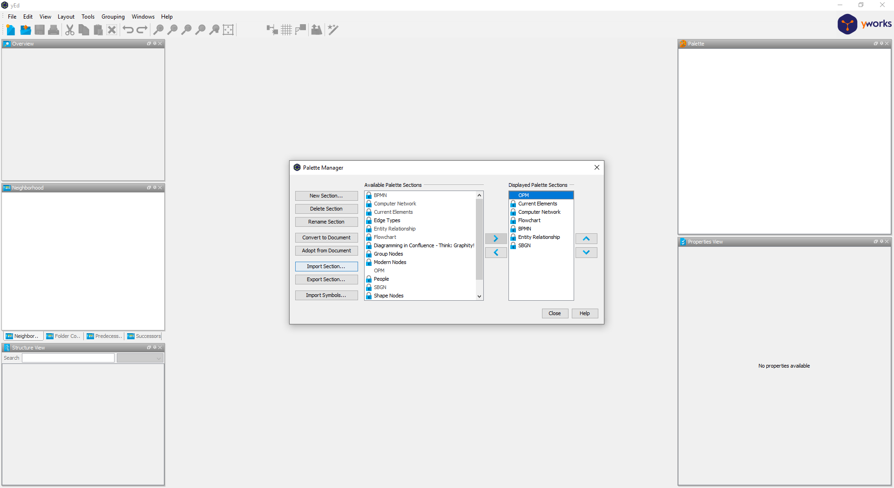
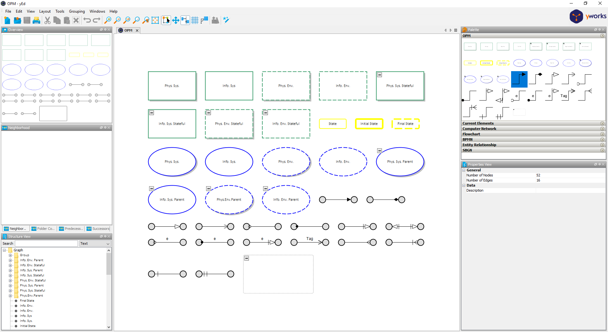

#+title: README

* Description
[[https://en.wikipedia.org/wiki/Object_Process_Methodology][Object--Process Methodology]] (OPM) palette for the [[https://www.yworks.com/products/yed][yEd Editor]]

* Setup
** Install yEd
https://www.yworks.com/products/yed/download#download

** Import OPM Palette
- Open "Manage Palette..."
  

- Create "New Section...."
  

- "Import Section...", select the =yEd_OPM_Palette.graphml= file
  

- Result
  

* CLI tool
Use =uv= to install the parser as a command-line tool.

#+begin_src sh
uv tool install -e .
#+end_src

This installs this command:
- =parse-opm=

If the command is not on your =PATH=, run this command once:

#+begin_src sh
uv tool update-shell
#+end_src

Open a new shell after =uv tool update-shell=.

Parse a palette file and print CSV to stdout:

#+begin_src sh
parse-opm yEd_OPM_Palette.graphml
#+end_src

Print JSON to stdout. The JSON includes the visible =label= for each node and edge:

#+begin_src sh
parse-opm yEd_OPM_Palette.graphml -f json
#+end_src

Print the fixed-width summary table to stdout:

#+begin_src sh
parse-opm yEd_OPM_Palette.graphml --format table
#+end_src

Write output to a file. If =--format= is omitted, the file extension selects the format:

#+begin_src sh
parse-opm yEd_OPM_Palette.graphml -o palette.csv
parse-opm yEd_OPM_Palette.graphml -o palette.json
parse-opm yEd_OPM_Palette.graphml -o palette.txt
#+end_src

Use =--format= or =-f= to override the extension:

#+begin_src sh
parse-opm yEd_OPM_Palette.graphml -f json -o palette.csv
#+end_src

For one-time use without installation, run this command:

#+begin_src sh
uv run parse-opm yEd_OPM_Palette.graphml
#+end_src
